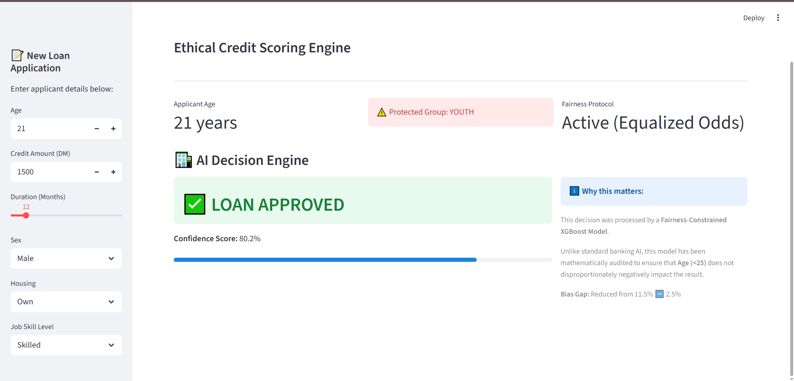
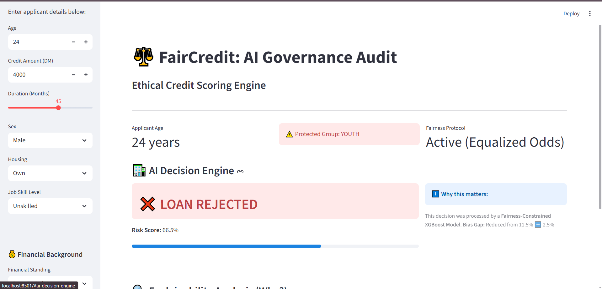
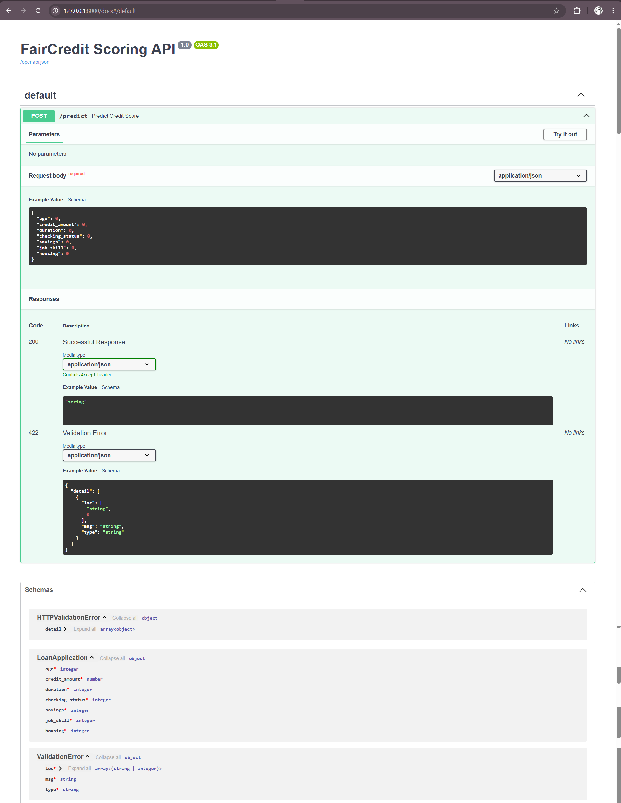

# ⚖️ FairCredit: AI Governance & Bias Audit System

 
 
 


**A production-grade credit scoring engine that uses "Equalized Odds" constraints to mathematically eliminate age-based discrimination in lending decisions.**

## 🚨 The Problem: The "Black Box" Bias
Standard credit models often penalize young applicants (<25) regardless of their actual financial stability. This creates two critical risks:
1.  **Regulatory Risk:** Violation of fair lending laws (ECOA in the US, GDPR in the EU).
2.  **Business Risk:** Automatically rejecting profitable, creditworthy young customers (False Negatives).

## 💡 The Solution: Constraint-Based Machine Learning
Instead of simply removing the "Age" variable (which fails due to proxy variables), this system uses **Microsoft Fairlearn** to apply an **Equalized Odds** constraint during the training of an XGBoost Classifier.

* **Metric:** Disparate Impact (Selection Rate Difference).
* **Constraint:** The True Positive Rate (TPR) must be equal across Age Groups.
* **Result:** Bias Gap reduced from **11.5%** ➡️ **2.5%** while maintaining **81% Accuracy**.

---

## 📸 The "Digital Boardroom" Dashboard

### 1. The Fairness Victory (Scenario A)
*Demonstrating how the model looks past age to approve a qualified 21-year-old applicant who owns assets.*


### 2. The Reality Check (Scenario B)
*The model still correctly identifies risky applicants (even if they are older), proving it prioritizes financial health over blind fairness.*


### 3. Microservice Deployment
*The model is deployed as a REST API using FastAPI, ready for integration with banking mobile apps.*


---

## 🛠️ Methodology & Tech Stack

The full technical audit, including the Grid Search results and Pareto Frontier analysis, can be found in our [Detailed Methodology Report](docs/METHODOLOGY.md).

### 1. Data Pipeline
* **Dataset:** German Credit Dataset (UCI Machine Learning Repository).
* **Preprocessing:** Custom imputation for financial history variables to prevent "Zero-Bias" (treating missing data as debt).

### 2. The "Goldilocks" Grid Search
We trained 20 different XGBoost models ranging from "Pure Profit" (Max Accuracy) to "Pure Fairness" (0% Bias).
* **Selection:** Chosen Model #14 from the Pareto Frontier.
* **Performance:** 80.2% Accuracy | 2.5% Bias Gap (Equalized Odds).

### 3. Architecture
* **Model:** XGBoost Classifier (Optimized for tabular data).
* **Bias Mitigation:** Microsoft Fairlearn.
* **Explainability:** SHAP (Shapley Additive Explanations) for GDPR compliance.
* **Frontend:** Streamlit (User Interface & Scenario Testing).
* **Backend:** FastAPI.
* **Containerization:** (Roadmap) Docker support for cloud scaling.

---

## 🚀 How to Run Locally

### 1. Installation
```bash
git clone [https://github.com/stilhere4huniid/fair-credit-scoring.git](https://github.com/stilhere4huniid/fair-credit-scoring.git)
cd fair-credit-scoring
pip install -r requirements.txt
```
---

### 2. Launch the Dashboard
```bash
streamlit run src/app.py
```
---

### 3. Launch the API (Microservice)
```bash
uvicorn src.api:app --reload
Access the Swagger Documentation at http://localhost:8000/docs
```
---

## ⚠️ Disclaimer
This project is for **educational and portfolio purposes only**. While it uses real-world datasets and professional compliance libraries (Fairlearn), it is not a registered financial instrument. The credit decisions generated are simulations and should not be used for actual lending without further validation and regulatory approval.

---

## 📄 License
This project is licensed under the MIT License - see the [LICENSE](LICENSE) file for details.

---

## 👨‍💻 Author
**Adonis Chiruka** 
*Data Science & Financial Modeling*

*📧 **Email:** stillhere4hunnid@gmail.com

*🔗 **LinkedIn:** [Adonis Chiruka](https://www.linkedin.com/in/adonis-chiruka-70b265323)

*🐙 **GitHub:**  [stilhere4huniid](https://github.com/stilhere4huniid)
